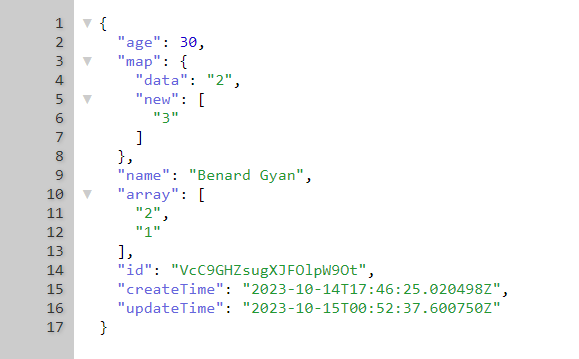

# firebase
Simplified Firebase Classes for your projects(PHP & JS)
Straight forward codes to easily use in your projects without hassle

### PHP Classes
```php
<?php
/*FirebaseAuth
FirebaseUser
FirebaseFirestore
FirestoreDB
Query
FieldFilter
CompositeFilter
UnaryFilter
PathBuilder
FirebaseCloudMessaging*/
?>
```

### PHP Example
```php
<?php
require_once('firebase.php');
$apiKey = 'AIzaSyxxxxxxxxxxxxxxxxxxxx';
$auth = new FirebaseAuth($apiKey);
if ($auth->isUserSignedIn() == true) {
    startApp($auth->getAccessToken());
} else {
    if ($auth->signInAnonymously()) {
        startApp($auth->getAccessToken());
    }
}

function startApp($token)
{
    $Database = '(default)';
    $ProjectID = 'xxxxxxxxxxx';
    // Create an instance of FirebaseFirestore
    $firestore = new FirebaseFirestore($token, $Database, $ProjectID);
    $db = $firestore->db;

    // Call the function to fetch Firestore data
/* Fetch a specific document
    $documentPath = 'users/xxxxxxx@ttu.edu.gh'; // Replace with your document path
    $document = $db->getDocument('users', 'xxxxxxxxxxxx');
    if ($document !== null) {
        echo $document;
    }

    // Fetch a collection
    $collectionPath = 'users'; // Replace with your collection path
    $collection = $db->getCollection($collectionPath);
    if ($collection !== null) {
        echo $collection;
    }
    $data = [
        "user_name" => "WOW 2",    
        "user_id" => "22195",    
    ];
    echo $db->updateDocument('users','22195',$data);
    */

    // Run a query
    $fieldFilter = new FieldFilter();
    $compositeFilter = new CompositeFilter();

    $fieldFilter->equalTo('user_name', 'WOW 2');

    $query = $db->query;
    $query->from('users')->where2($fieldFilter);
    echo $query->run();
}
?>
```

### Cloud Messaging PHP Example
```php
<?php
require_once('firebase.php');
// Usage:
$credentialsPath = 'serviceAccountCredentials.json';
$topics = 'ios_general';
$title = 'Title of Notification';
$body = 'Body of Notification';
$fcm = new FirebaseCloudMessaging($credentialsPath);

$accessToken = $fcm->getAccessToken();
//echo $accessToken;
$response = $fcm->sendFCMNotificationToTopic($accessToken, $topics, $title, $body);
echo $response;
```

## Sample Query
<br/></img>
